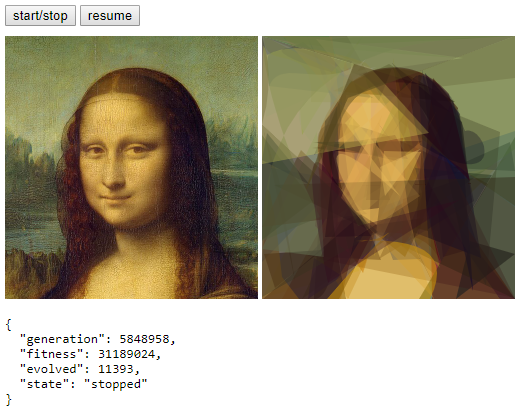

# EvoLisaJS

A swing at creating EvoLisa using Javascript.

EvoLisa is a program by Roger Johansson that uses genertic algorithms to recreate an image of the Mona Lisa using just polygons.  The original .Net code can be found at https://rogerjohansson.blog/2008/12/07/genetic-programming-evolution-of-mona-lisa/

This version of it uses TypeScript and does things in a way that may only be compatible with the latest browsers.  It was tested on the latest Chrome and Firefox and worked just fine.  Your mileage may vary depending on what browser you use.

If you want to change the image, update the `data-img` attribute on the canvas tag in `index.html`.

## Example output

After running for quite some time:



## Get up and running

The main code is written using [TypeScript](https://www.typescriptlang.org/), so you'll need to compile the source code in order to use it as plain javascript.

If you haven't already, install TypeScript using _npm_ with the command:

```
npm install -g typescript
```

This will globally install the required TypeScript tools.  You can then run the command:

```
tsc
```

to compile the TypeScript files into the _dist_ directory where they will be ready for use by the browser.  Then open up the _index.html_ file in your browser.  If you get CORS errors then you may find you need to start a small web server in order to run the _index.html_.  I have PHP installed, so do `php -S localhost:8080 -t .` from the repo root and then go to `http://localhost:8080/` in my browser.
